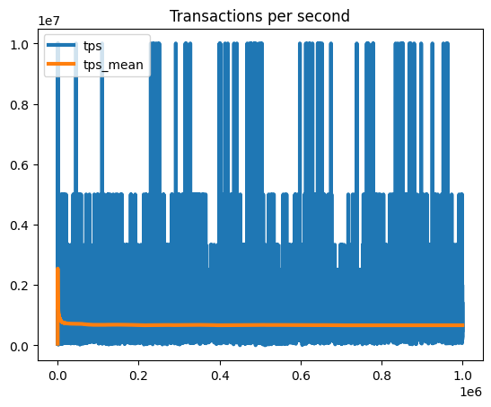

# Orderbook Simulator
The project consists of an order and an orderbook simulator. 

## Order simulator
Generates orders given the following parameters: 
* `max_orders`: max num of orders to generate
* `n_traders`: number of traders that will send the orders
* `n_tasks`: number of async jobs to generate the orders
* `price`: static price that will be used as guide to generate orders from
* `price_dev`: standard deviation to generate limit orders from
* `price_decimals`: number of decimals for the price
* `latency_min`: minimum latency between each generated order
* `latency_max`: maximum latency between each generated order
* `qty_max`: maximum order quantity.
* `pct_limit_orders`: percent of limit orders

To run it: 
```
cargo run --release --bin generate_orders
```

It will store the output in a CSV file located in the folder `order_simulations`.
## Orderbook Simulator
Efficient orderbook able to handle over 1mln transactions per second. 
Consists of two `BTreeMaps<Price, Vec<OrderIdx>>`, one for asks and another one for bids. `Vec<OrderIdx>` store indices for each order. Orders are stored in an `IndexMap<OrderIdx, Uuid, LimitOrder>`.

It's able to find a Price level in O(log(n)). Insertions, deletes and updates have an average complexity of O(1).

To run it: 
```
cargo run --release --bin orderbook_simulator
```

It will store the output in a CSV file located in the folder `executions`.

After running the two commands to generate orders and executions, go to [Analyzing_orderbook.ipynb](Analyzing_orderbook.ipynb) and click on "Run All" in your Jupyter Notebook to see all the stats for your simulation.

## Notes
The simulations were run in my laptop with these specs:
* Processor	11th Gen Intel(R) Core(TM) i7-1185G7 @ 3.00GHz   1.80 GHz
* Installed RAM	16.0 GB (15.4 GB usable)
* System type	64-bit operating system, x64-based processor

Created an Orderbook with capacity of 1mln orders and queues per price level of 100k. Processed 1mln orders at 664644 Transactions Per Second (TPS). 



Ran another simulation multiplying the stats of the previous one by 10x and achieved 656749 TPS.

It's important to note that the orders are normally distributed around current price. If the orders were evenly distributed accross N levels, it would be unrealistic since it wouldn't simulate market dynamics. Processing evenly distributed orders yields 2516276 TPS, the reason is because most of them are Insert, which is less expensive than Cancel or Update operations.

See all the stats on the following notebook: [Analyzing_orderbook.ipynb](Analyzing_orderbook.ipynb)

## Improvements
* Orders currently are generated at just one precise moment in time. Would be nice to create random market price and generate N orders following the dynamic price.
* Create a websocket server to simulate real world scenario. Right now it's just reading from a CSV and looping through all orders in a single thread. The stats will differ in a multi-threaded context.
* Orderbook architecture could be improved. Using a Slab for the BTreeMap and preallocate memory at initialization would improve the overall results. 
* Error handling and tests
* Profile and benchmark to find bottle necks
